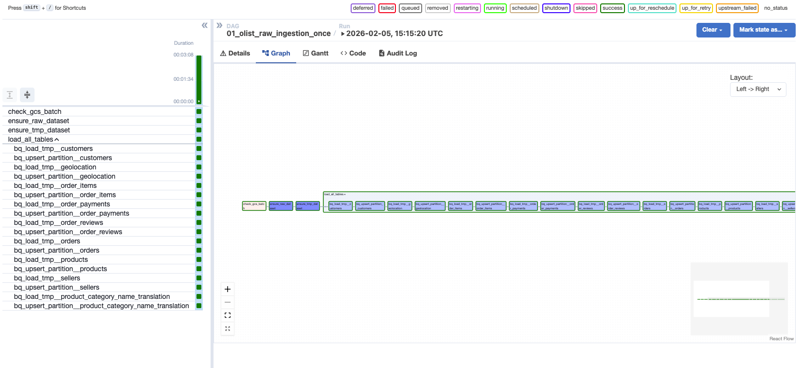
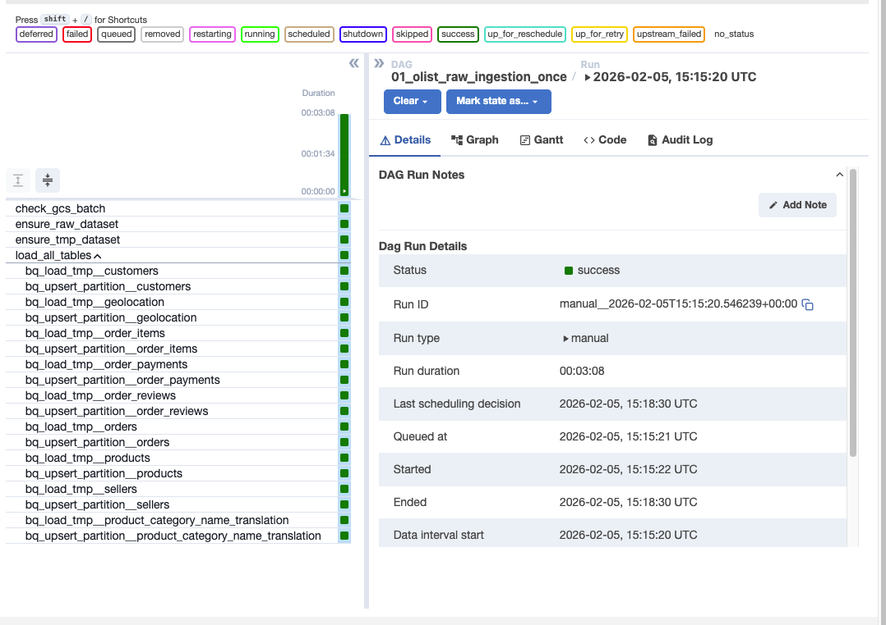
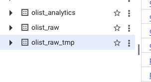
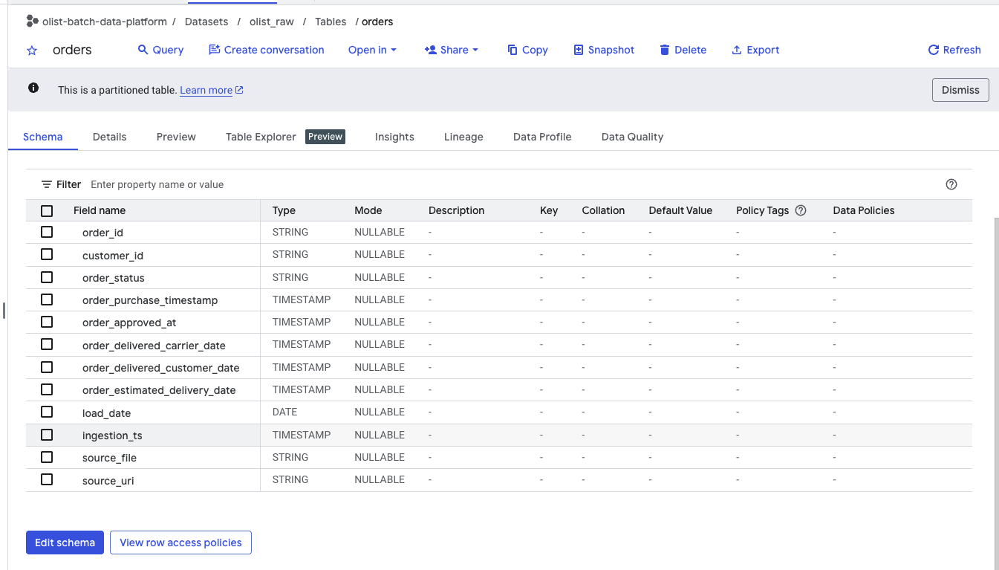
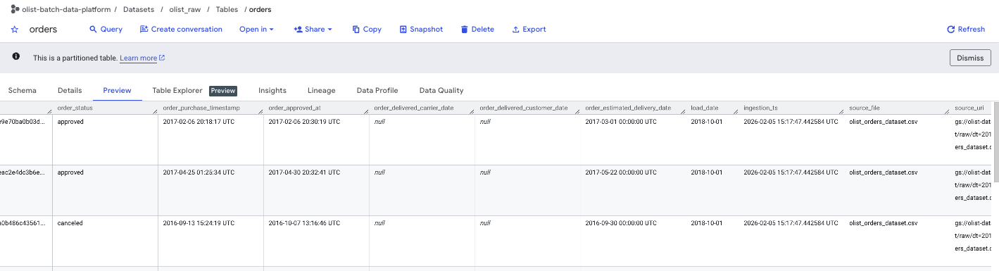
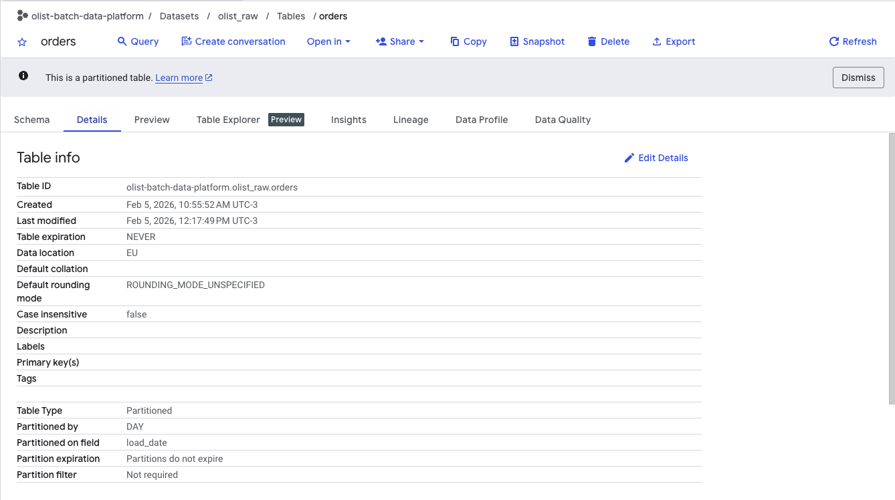
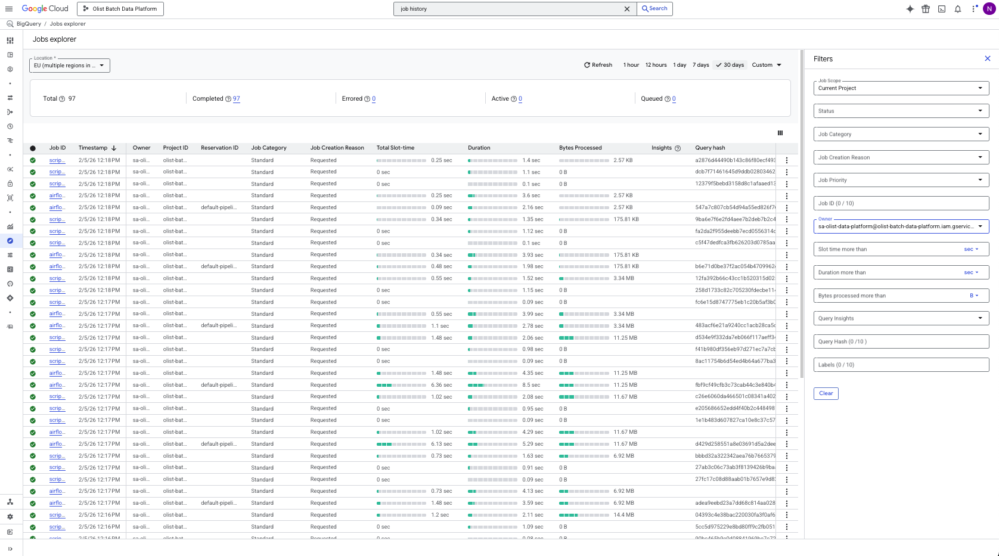
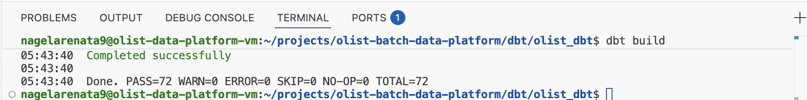

# Olist Batch Data Platform (GCP | Airflow | dbt | BigQuery)

A production-like batch data platform that simulates a real-world e-commerce analytics environment using Apache Airflow, BigQuery, and Google Cloud.

The project demonstrates end-to-end data engineering practices, including orchestration, incremental ingestion, metadata management, cost control, and layered data architecture.

---

## Architecture Overview

The platform is built on Google Cloud Platform and follows a modern batch analytics architecture:

- **Cloud Provider:** GCP (EU region)
- **Storage:** Google Cloud Storage (raw landing zone)
- **Orchestration:** Apache Airflow (Docker on Compute Engine)
- **Data Warehouse:** BigQuery
- **Transformation:** dbt (staging, intermediate and analytical models implemented)
- **Visualization:** Looker Studio (planned)

Data flows:

GCS → Airflow → BigQuery Raw → dbt (Staging/Silver → Intermediate → Marts/Gold) → Looker Studio

---

## Data Modeling (dbt)

The transformation layer follows a layered modeling approach:

- **Staging (Silver):** Source-aligned models with data type casting, standardization and ingestion lineage.
- **Intermediatee:** Current-state models built using load_date and ingestion_ts to resolve latest records.
- **Marts (Gold):** Business-ready dimensional models designed for analytics and BI consumption.
- **Data Warehouse:** BigQuery
- **Transformation:** dbt (staging, intermediate and analytical models implemented)
- **Visualization:** Looker Studio (planned)

Model structure:

models/
  staging/
  intermediate/
  marts/
    dimensions/
    facts/

All models include:
- Data quality tests (not_null, unique, relationships)
- Incremental-ready structure
- Source lineage and operational metadata

---

## Key Features

- Batch ingestion from CSV files stored in GCS
- Historical raw layer versioned by `load_date`
- Idempotent partition loads (existing partitions are replaced during reprocessing)
- BigQuery tables partitioned by `load_date`
- Ingestion metadata added to all records:
  - `load_date`
  - `ingestion_ts`
  - `source_file`
  - `source_uri`
- Reprocessing safety: each execution replaces the target `load_date` partition, ensuring idempotent behavior and preventing duplicate records
- Sequential execution using Airflow pools to control resource usage
- Cost-aware architecture designed for GCP Free Trial
- Secure authentication using:
  - Service Account attached to VM
  - Application Default Credentials (ADC)
  - IAP + OS Login for SSH access

---

## Data Quality

Data quality is enforced using dbt tests:

- Primary key uniqueness
- Not-null constraints
- Referential integrity between facts and dimensions
- Accepted values and domain validation
- The current implementation includes 70+ automated data tests executed during each dbt build.

---

## End-to-End Execution

### Airflow DAG Execution

The ingestion pipeline runs sequentially to control memory usage and BigQuery costs.

---

### BigQuery Layered Structure

Datasets created and managed by the pipeline:

- `olist_raw`
- `olist_raw_tmp`
- `olist_analytics`

---

### Raw Table Design

Raw tables are partitioned by ingestion date and include operational metadata.

---

### Data Preview

Example data loaded into the raw layer.

---

### Partition Configuration

Tables are partitioned by `load_date` to support incremental processing.

---

### BigQuery Jobs Execution

All ingestion jobs are executed by Airflow using the platform Service Account.

---

### dbt Execution – Staging and Intermediate Layers

Staging and intermediate models were successfully built and validated with data quality tests.

---

## Cost Management

This project was developed under the GCP Free Trial and applies basic FinOps principles:

- Project budget with alert thresholds
- Lightweight Compute Engine configuration
- VM stopped when not in use
- Sequential pipeline execution to avoid cost spikes

---

## Security

- No service account keys (JSON)
- Authentication via Application Default Credentials (ADC)
- Dedicated runtime Service Account
- Secure SSH via IAP + OS Login
- IAM scoped using least-privilege principles

---

## Reproducibility Baseline (v0)

This repository has a validated baseline for the ingestion layer.

Verified scope:
- Airflow running on Docker Compose (webserver + scheduler + postgres)
- One-shot ingestion DAG executed successfully
- GCS → BigQuery load into `olist_raw` with ingestion metadata
- Partition-based idempotency (`load_date` partition overwrite)

If issues occur after this point, they are expected to be related to subsequent work (dbt models, tests, marts, dashboards, etc.).

See docs/baseline-ingestion-v0.md for full reproducibility instructions.

---

## Project Status

Current implementation:

- Raw ingestion pipeline (Airflow)
- Staging and intermediate dbt models
- Latest-state resolution using ingestion metadata
- 70+ automated data quality tests
- Layered warehouse architecture (Raw → Silver → Gold)

Next steps:

- Build dimensional marts (facts and dimensions)
- Implement incremental materializations
- Publish Looker Studio dashboards

---

## Documentation

Detailed architecture and design decisions are available in:

- `docs/00_project_scope.md`
- `docs/01_cost_management.md`
- `docs/02_authentication_and_security.md`
- `docs/03_architecture.md`
- `docs/baseline-ingestion-v0.md`
- `docs/99_engineering_log.md`

---

## Current Phase

Raw ingestion layer completed and stabilized.

Future development will focus on:
- Analytical marts (Gold)
- Looker Studio dashboards