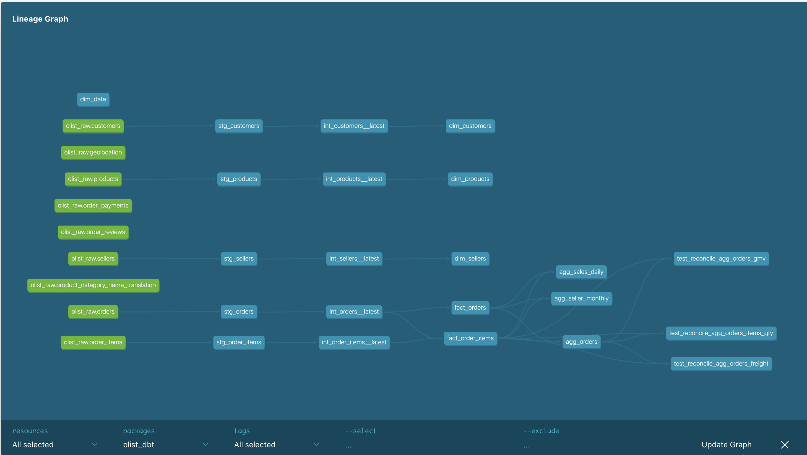
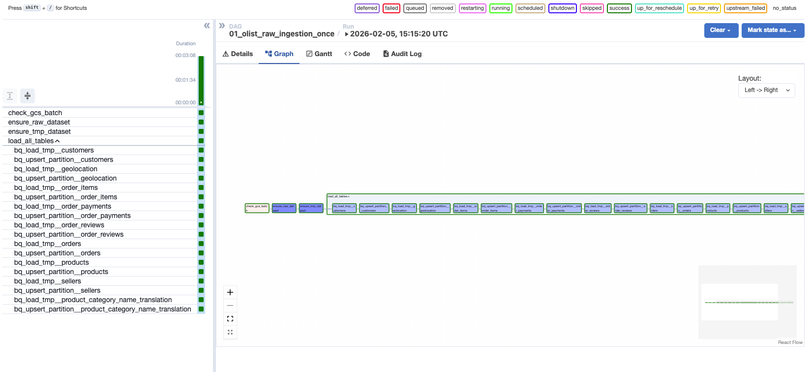
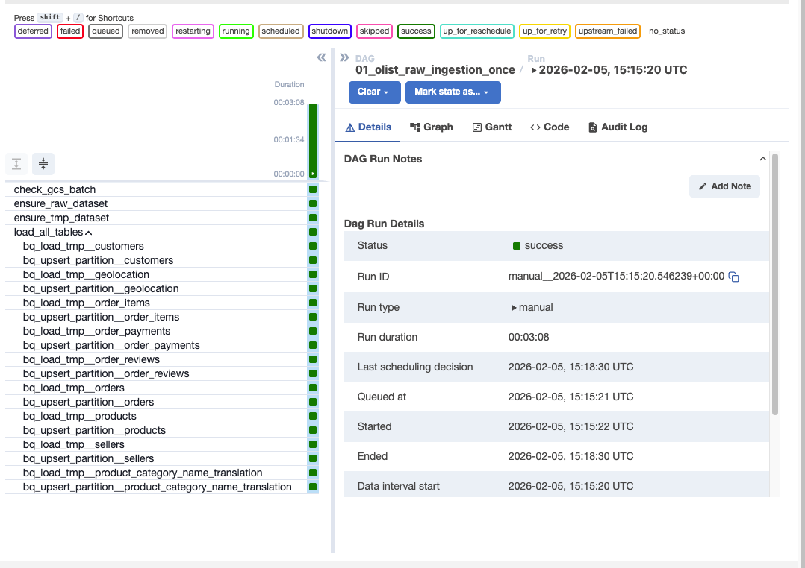
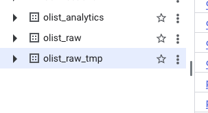
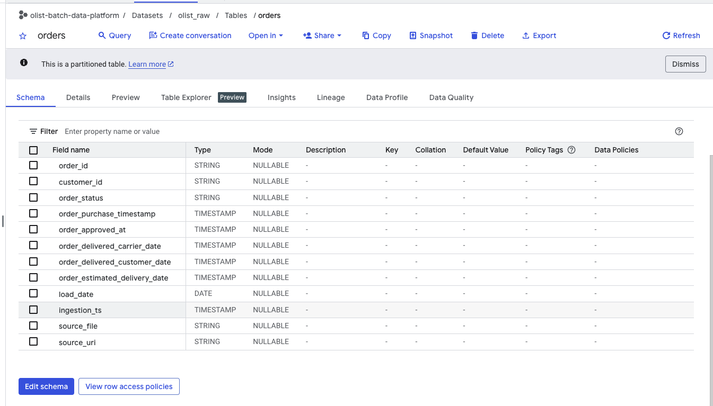
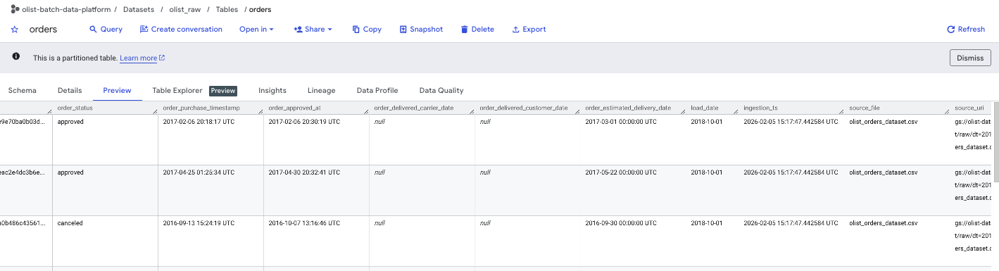
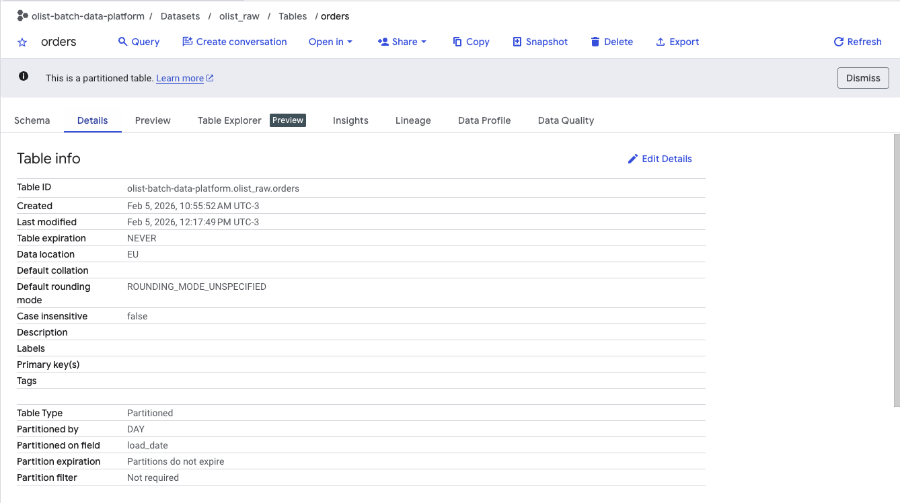
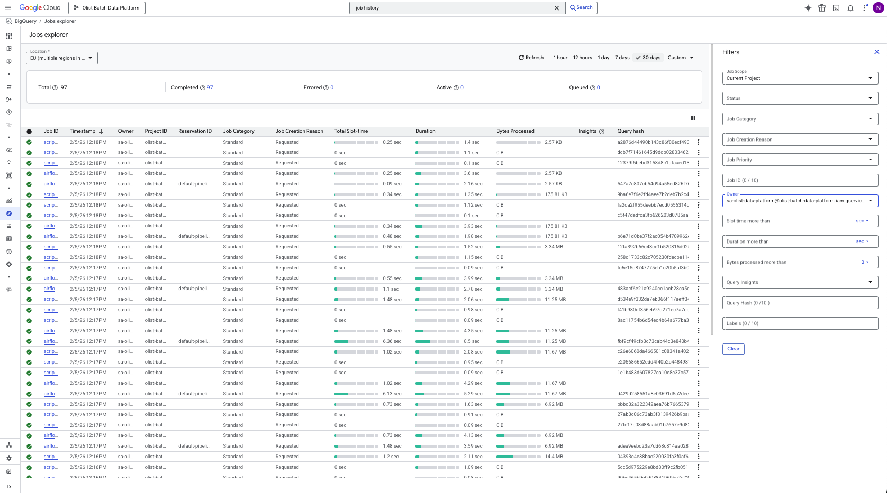
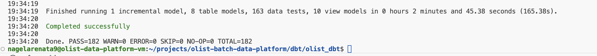

# Olist Batch Data Platform (GCP | Airflow | dbt | BigQuery)

A production-like batch data platform that simulates a real-world e-commerce analytics environment using Apache Airflow, BigQuery, and Google Cloud Platform.

The project demonstrates end-to-end data engineering practices, including:

- Orchestration and dependency management
- Idempotent batch ingestion
- Partition-aware incremental processing
- Deterministic surrogate key generation
- Dimensional modeling (Kimball-style star schema)
- Cross-grain reconciliation testing
- Source freshness monitoring
- Operational metadata tracking
- Cost control under cloud free-tier constraints

---

## Architecture Overview

The platform is built on Google Cloud Platform and follows a modern batch analytics architecture:

- **Cloud Provider:** GCP (EU region — europe-west1)
- **Storage:** Google Cloud Storage (raw landing zone)
- **Orchestration:** Apache Airflow (Docker Compose on Compute Engine)
- **Data Warehouse:** BigQuery
- **Transformation:** dbt (staging, intermediate, and analytical models)
- **Visualization:** Looker Studio (planned)

Data flows:

GCS → Airflow → BigQuery Raw → dbt (Staging/Silver → Intermediate → Marts/Gold) → Looker Studio

---

## Data Modeling (dbt)

The transformation layer follows a layered modeling approach:

- **Staging (Silver):** Source-aligned models with type casting, standardization, and ingestion lineage preservation.
- **Intermediate:** Current-state views built using `load_date` and `ingestion_ts` to resolve the latest record per business key.
- **Marts (Gold):** Business-ready dimensional models designed for analytics and BI consumption.

### Model structure

```
models/
  staging/
  intermediate/
  marts/
    dimensions/
    facts/
    aggregations/
```

### Dimensional Modeling Strategy

The Gold layer follows Kimball-style dimensional modeling principles:

- Surrogate keys generated via `dbt_utils.generate_surrogate_key()`
- Natural keys preserved for reconciliation and traceability
- Degenerate dimensions (e.g., `order_id`) retained in fact tables
- Conformed dimensions shared across multiple facts
- Star schema structure optimized for BI queries

```
              dim_customers
                    |
dim_date ←─ fact_order_items ─→ dim_products
                    |
              dim_sellers

dim_date ←─ fact_orders ─→ dim_customers
```

### Gold Layer Models

**Dimensions:** `dim_customers`, `dim_products`, `dim_sellers`, `dim_date`

**Facts:**
- `fact_order_items` — grain: one row per (order_id, order_item_id); item-level commercial metrics
- `fact_orders` — grain: one row per order_id; delivery metrics and SLA indicators

**Aggregations:**
- `agg_orders` — order-level reconciliation summary
- `agg_sales_daily` — daily KPIs; incremental model (merge on `order_purchase_date_key`)
- `agg_seller_monthly` — monthly seller performance metrics

---

## Model Lineage

The diagram below shows the full dbt model dependency graph, as rendered by `dbt docs`.



---

## Data Quality

Data quality is enforced using dbt tests:

- Primary key uniqueness
- Not-null constraints
- Referential integrity between facts and dimensions
- Accepted values and domain validation
- **Cross-grain reconciliation tests** (singular dbt tests): validate that GMV, freight, and item quantity are consistent across `fact_order_items`, `fact_orders`, and `agg_orders` — preventing silent metric inflation from incorrect joins

The current implementation includes 163 automated tests executed during each `dbt build`.

**Source freshness monitoring** is configured via `dbt source freshness`: transactional tables warn after 25h and error after 49h. The pipeline fails fast if raw data is stale before any transformation runs.

---

## Local Development

This project uses [just](https://github.com/casey/just) as a command runner. Run `just` to list all available commands.

| Command | Description |
|---|---|
| `just up` | Start the stack (builds image if needed) |
| `just down` | Stop the stack |
| `just logs` | Follow container logs |
| `just test` | Run tests inside the scheduler container |
| `just cov` | Run tests with coverage report |
| `just fmt` | Format code with black |
| `just fmt-check` | Check formatting without applying changes |
| `just docs-gen` | Generate dbt docs (catalog + manifest) |
| `just docs-serve` | Serve dbt docs on http://localhost:18080 |

---

## End-to-End Execution

### Execution Flow

```
Airflow ingestion → dbt deps → dbt source freshness → dbt build (includes tests)
```

### Airflow DAG Execution

The ingestion pipeline runs sequentially to control memory usage and BigQuery costs.





---

### BigQuery Layered Structure

Datasets created and managed by the pipeline:

- `olist_raw_tmp` — transient staging dataset used during ingestion
- `olist_raw` — immutable raw layer, partitioned by `load_date`
- `olist_analytics` — dbt-managed staging, intermediate, and Gold models



---

### Raw Table Design

Raw tables are partitioned by ingestion date and include operational metadata.



---

### Data Preview

Example data loaded into the raw layer.



---

### Partition Configuration

Tables are partitioned by `load_date` to support incremental processing.



---

### BigQuery Jobs Execution

All ingestion jobs are executed by Airflow using the platform Service Account.



---

### dbt Execution

Full `dbt build` completed successfully: 19 models + 163 data tests, 0 errors, 0 warnings.



---

## Key Features

- Batch ingestion from CSV files stored in GCS
- Historical raw layer versioned by `load_date`
- Idempotent partition loads (existing partitions are replaced during reprocessing)
- BigQuery tables partitioned by `load_date` with ingestion metadata on all records
- Sequential Airflow execution using pools to control resource usage on a constrained VM
- Incremental aggregation (`agg_sales_daily`) with merge strategy and late-arrival lookback
- Cross-grain reconciliation tests enforcing analytical correctness across model grains
- Source freshness monitoring with fail-fast pipeline behavior
- Cost-aware architecture designed for GCP Free Trial
- Secure authentication via Service Account ADC (no key files), IAP + OS Login for SSH

---

## Cost Management

This project was developed under the GCP Free Trial and applies basic FinOps principles:

- Project budget with alert thresholds (5%, 20%, 50%)
- Lightweight Compute Engine configuration (e2-medium)
- VM stopped when not in use
- Sequential pipeline execution to avoid cost spikes

---

## Security

- No service account keys (JSON)
- Authentication via Application Default Credentials (ADC)
- Dedicated runtime Service Account with least-privilege IAM
- Secure SSH via IAP + OS Login
- Dataset-level IAM (no project-wide permissions)

---

## Project Status

**Implemented and validated:**

- Raw ingestion pipeline (Airflow + GCS → BigQuery)
- Staging and intermediate dbt models
- Gold layer: dimensions, fact tables, and aggregations
- Incremental materialization (`agg_sales_daily`)
- 70+ automated data quality tests
- Cross-grain reconciliation tests
- Source freshness monitoring

**Planned:**

- Looker Studio dashboards
- Incremental materializations for remaining fact models
- Published dbt docs (GitHub Pages)

---

## Documentation

- [`docs/00_project_scope.md`](docs/00_project_scope.md)
- [`docs/01_cost_management.md`](docs/01_cost_management.md)
- [`docs/02_authentication_and_security.md`](docs/02_authentication_and_security.md)
- [`docs/03_architecture.md`](docs/03_architecture.md)
- [`docs/04_gold_contract.md`](docs/04_gold_contract.md)
- [`docs/05_reconciliation_strategy.md`](docs/05_reconciliation_strategy.md)
- [`docs/99_engineering_log.md`](docs/99_engineering_log.md)